# HAMR_Manipulation
**This repo only contains main contribution of my work, other minor (but also important) contribution and open-source ROS program (such as navigation package from ROS official) are not included, so directly download this repo and run it will not work. I do hope this repo and documentation will help you.**

## Background
We've studied most the commercial available AMR (autonomous mobile robot) with robotic arm products in the market are heavy and only capable for light-weight manipulation. I decided to make our own robot with high payload capacity but also in relative small scale and light weight.
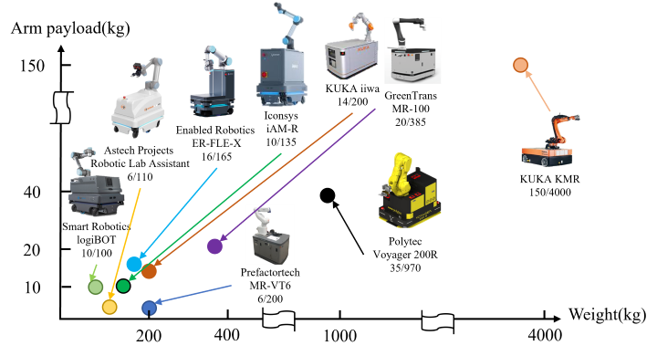
## Objective Goal
the goal of this research is to integrate robotic arm and a omni-wheel chassis that provides its high payload capability, high accuracy and high speed, I call it HAMR (High payload Autonomous Mobile Robot)
Moreover, base on the chassis and robot, I added a Pepper Fuchs LiDAR (ODM30M-R2000) and 2 IMU sensors (Pepper Fuchs IMU360D, TAObotics HFI-A9) to perform Extended Kalman Filter for robot localization.

## Setup
### Hardware
1. KUKA KR70 R2100 robotic arm (maximum payload: 80kg; maximum speed: 2m/s)
2. Adlee 3700W brushless motor *4 (with reduction gears)
3. Advantech ARK-1250L (i5-1145G7E, DDR4 16GB)
4. Pepper fuch ODM30M-R2000 LiDAR
5. Pepper fuch IMU360D-F99 IMU
6. ICP-DAS GW-7238D J1939-Modbus TCP gateway

#### Hardware Design
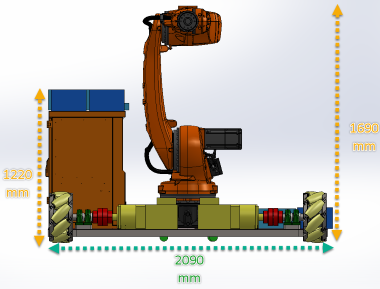
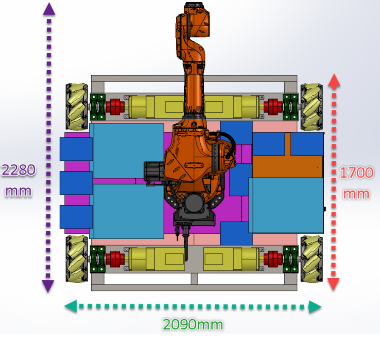

#### Structure FEM Analysis
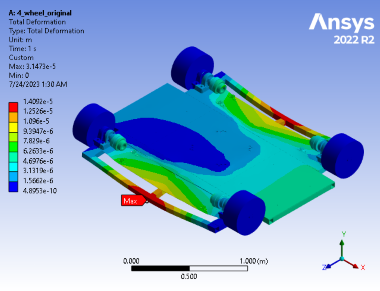
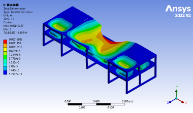

#### Electricity Layout
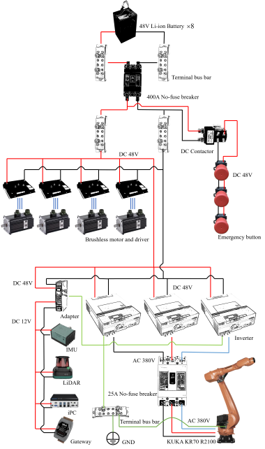

#### Robot Assembly
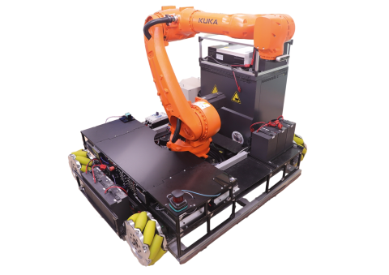

### Software
1. ROS1 Noetic (base on [Adlink ros_menu](https://github.com/Adlink-ROS/ros_menu))
2. C++ 9.0.4
3. Python 3.8.10
4. Hector SLAM (for map building)
5. KUKA KCL EthernetKRL package (commercial package)

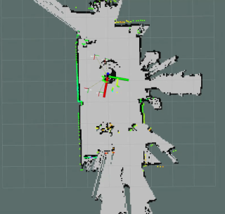

### Prerequest
1. All hardware work normal (power, signal and wire connection).
2. Step 1 actually took me 3 months!
3. Use CAD file to determine the TF broadcaster value to get the coordinate trnasformation in ROS. As dictionary "dal_tf" defined.

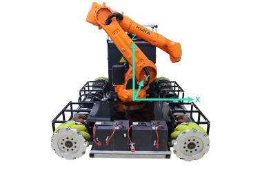

## Dictionary Explain
1. config: Config file for rviz. Those will be used automatically based on the launch file.
2. amr_urdf: HAMR 3D model with movable joint/axis. Normally I prone to not use this model to save computation power.
3. dal_tf: Coordinate transform broadcaster. Open this before open LiDAR and SLAM.
4. fromTopictoCSV: Save value from ROS Topic to CSV for post-processing.
5. imu360: Self-made P+F IMU360-F99 IMU driver for ROS. Works with ICP-DAS J1939 gateway.
6. motor_control: Receive velocity from ROS topic and do the inverse kinematic; Send the velocity command to brushless motor driver.
7. kuka_control: Receive command from ROS topic and transmit to KUKA controller by TCP. The logic behind this program will be explained below.

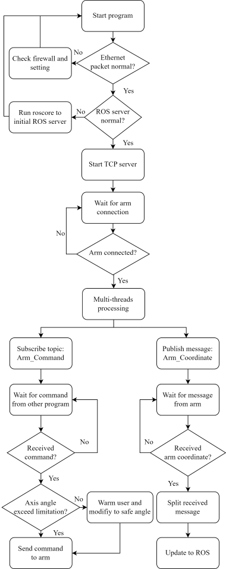
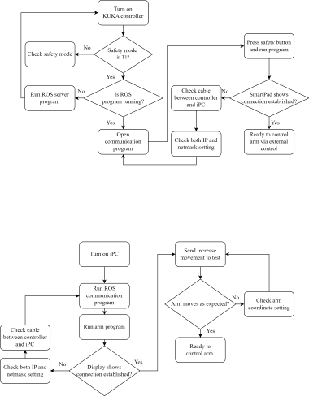

## Extended Kalman Filter
Extended Kalman Filter for robot localization has been well studied in the past decades. As a result, I will skip the derivative process of EKF in this case and only show the result of data fusion of LiDAR and IMUs.

## Demo Video
[Demo video](https://drive.google.com/file/d/1FXoi4q90yTjT7BAU1lf2f6oE_PefTzcD/view?usp=drive_link)